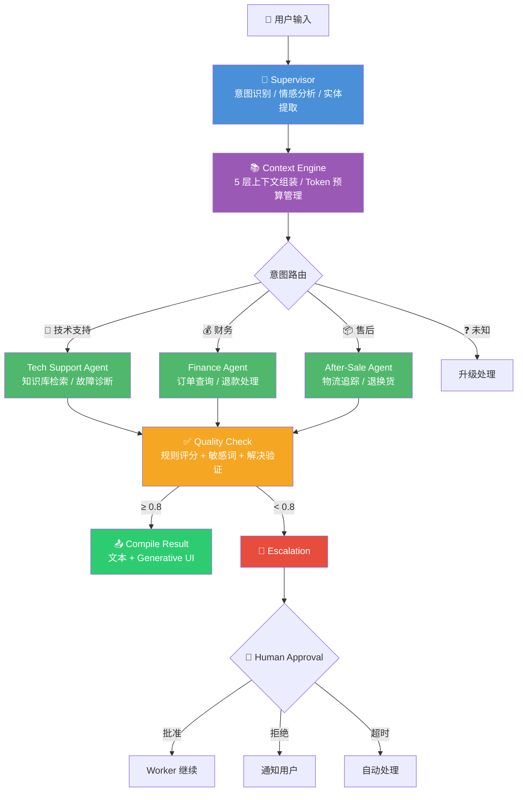

# 🤖 多 Agent 智能客服分流系统

> 基于 **LangGraph + FastAPI** 的多智能体协作客服系统。LLM 意图识别 → Supervisor 自动分流 → 专业 Worker Agent 处理 → 质检审核 → 人机协同审批。支持 SSE 流式推送、Generative UI 动态组件、5 层安全防护、全链路可观测。

<div align="center">

[](https://www.python.org/)
[](https://fastapi.tiangolo.com/)
[](https://langchain-ai.github.io/langgraph/)
[](https://deepseek.com/)
[](./docker-compose.yml)
[](./LICENSE)
[](./tests/)
[](./tests/test_golden_eval.py)

</div>

---

## 📖 目录

- [系统架构](#-系统架构)
- [核心能力](#-核心能力)
- [Generative UI](#-generative-ui)
- [快速开始](#-快速开始)
- [API 文档](#-api-文档)
- [项目结构](#-项目结构)
- [技术栈](#-技术栈)
- [开发路线](#-开发路线)

---

## 🏗 系统架构



### 执行流程

| 阶段 | 节点 | 核心职责 |
|:---:|------|------|
| 🧠 | `classify_intent` | LLM 分类意图（技术/财务/售后/未知）+ 情感识别 + 实体提取 |
| 📚 | `extract_context` | 5 层上下文组装（系统 > 记忆 > 知识 > 对话 > 工具结果），Token 预算控制 |
| 🛠️ | `tech / finance / after_sale` | LangGraph ReAct Agent 自主调用工具，多轮对话完成任务 |
| ✅ | `quality_check` | 规则评分 + 幻觉检测 + 敏感词扫描 + 解决验证 |
| 🚨 | `escalation` | 超轮次 / 低评分 / 用户要求 → 生成摘要准备转人工 |
| 👤 | `human_approval` | 大额退款 (>¥1000) / 敏感操作 → interrupt_before 暂停，人工审批后恢复 |
| 📤 | `compile_result` | 聚合文本回复 + 动态 UI 组件（物流卡片等）|

---

## ✨ 核心能力

<table>
<tr>
<td width="50%">

### 🧠 智能分流
- LLM 意图分类 + 关键词兜底规则
- **情绪识别**（positive / neutral / anxious / angry / frustrated）
- 实体提取（订单号、快递单号、用户 ID）
- 低置信度自动升级，防止误判

### 🤝 多 Agent 协作
- 3 个专业 Worker Agent（技术/财务/售后）
- LangGraph `create_react_agent` 自主决策工具调用
- Supervisor 统一调度 + 条件路由
- Slot-Filling 对话状态管理

### 🛡️ 5 层安全防护
```
输入守卫 → 工具沙箱 → RBAC/ABAC → 策略护栏 → 输出审计
```
- 提示注入 / SQL 注入 / XSS 检测
- 工具调用参数校验 + 隔离执行
- 5 级角色权限 + 属性级访问控制
- 输出敏感信息自动脱敏
- 防篡改审计日志（hash-chained）

</td>
<td width="50%">

### 👤 人机协同（HITL）
- LangGraph `interrupt_before` 暂停/恢复
- 大额退款 (>¥1000) 自动触发审批
- 内置审批管理 Web UI
- 多通道通知（Console / File / WebSocket 就绪）
- 超时自动处理策略

### 📊 全链路可观测
- **LangFuse** 全链路 Tracing（节点耗时、Token 用量）
- **6 类告警规则**（高延迟 / 异常消耗 / 质量下滑 / 高频升级 / 级联失败 / 高错误率）
- **成本追踪**（按会话 / 用户 / Agent / 日期维度）
- Chart.js 实时监控面板

### 🧠 三层记忆系统
- **工作记忆**：当前任务进度、槽位状态
- **短期记忆**：滑动窗口对话历史，LLM 自动摘要
- **长期记忆**：Qdrant 向量存储用户画像 / 偏好 / 历史决策

</td>
</tr>
</table>

---

## 🎨 Generative UI

系统支持在对话中**动态渲染可视化组件**，而不只是纯文本回复。

### 物流追踪卡片

查询快递时，回复气泡内会渲染一张可视化物流卡片：

```
┌─────────────────────────────────────────┐
│ 📦 圆通速递        运单号: YD8324687182  │
│                                         │
│  ● 已揽收    06-07 19:44  南京分拣中心   │
│  │                                     │
│  ● 运输中    06-08 02:15  南京→北京     │
│  │                                     │
│  ● 到达中转  06-09 08:00  北京分拣中心   │
│  │                                     │
│  🟠 派送中   06-09 09:30  北京分拣中心   │
│                                         │
│  预计送达：2026-06-10                    │
└─────────────────────────────────────────┘
```

**扩展方式**：新增组件只需 2 步 ——
1. 后端 `compile_result` 生成 `{type, data}` 字典
2. 前端注册一个 render 函数到 `COMPONENT_RENDERERS` 注册表

---

## 🚀 快速开始

### 前置要求

| 依赖 | 版本 | 用途 |
|------|------|------|
| Docker + Compose | 最新 | 容器运行时（方式一） |
| Python | 3.11+ | 本地开发（方式三） |
| DeepSeek API Key | — | LLM 调用（在 `.env` 中配置） |

---

### 方式一：Docker 一键启动（推荐，零安装依赖）

```bash
cd D:\项目4\agent\multi-agent-cs

# 1. 确认 .env 中 LLM_API_KEY 已配置
#    （复制 .env.example 为 .env 并填入你的 DeepSeek API Key）

# 2. 一键启动
bash scripts/run_docker.sh
```

首次启动需拉取镜像并构建，约 2-5 分钟。之后秒启。脚本会自动等待服务就绪并打印访问地址。

```bash
bash scripts/run_docker.sh              # 启动所有服务
bash scripts/run_docker.sh --build      # 重新构建镜像并启动
bash scripts/run_docker.sh --down       # 停止并清理所有容器
```

也可直接用原生 Docker 命令：

```bash
docker compose up -d      # 启动
docker compose down       # 停止
curl http://localhost:8000/health   # 验证
```

启动后访问：

| 面板 | 地址 |
|------|------|
| AI 聊天界面 | http://localhost:8000/api/v1/agent/chat/ui |
| API 文档 | http://localhost:8000/docs |
| 人工审批面板 | http://localhost:8000/api/v1/approval/ui |
| 可观测性面板 | http://localhost:8000/api/v1/observability/ui |
| 健康检查 | http://localhost:8000/health |

---

### 方式二：Kubernetes 部署（生产级）

#### 开启 K8s

Docker Desktop 自带 K8s，开启方法：

1. 打开 Docker Desktop
2. 右上角齿轮 → **Settings** → 左侧选 **Kubernetes**
3. 勾选 **Enable Kubernetes** → 点 **Apply & Restart**
4. 等左下角 Kubernetes 图标变绿（首次需下载镜像，约 5-10 分钟）

验证是否就绪：

```bash
kubectl version          # 能看到 Server Version 即成功
kubectl get nodes        # 显示 Ready 状态的节点
```

#### 部署项目

```bash
# 1. 构建镜像
cd D:\项目4\agent\multi-agent-cs
docker build -t multi-agent-cs:latest .

# 2. 部署到 K8s
kubectl apply -f k8s/deployment.yaml

# 3. 查看启动状态
kubectl -n agent-cs get pods -w
```

看到 Pod STATUS 变为 `Running` 即部署成功。

常用命令：

```bash
kubectl -n agent-cs get pods                    # 查看所有 Pod
kubectl -n agent-cs logs -l app=multi-agent-cs  # 查看日志
kubectl -n agent-cs describe pod <pod名>         # 查看详细信息
kubectl delete -f k8s/deployment.yaml           # 卸载
```

> 如果本机没开 Docker Desktop K8s，也可以用 Minikube 或云上集群（阿里云 ACK 等）。

---

### 方式三：本地开发（热重载，适合改代码调试）

```bash
# 1. 克隆项目
git clone https://github.com/lumfei/-agents-.git
cd -agents-

# 2. 配置环境变量
cp .env.example .env
# 编辑 .env，填入 LLM_API_KEY=sk-your-deepseek-api-key

# 3. 安装依赖
pip install -r requirements.txt

# 4. 启动中间件
docker compose up -d redis qdrant postgres

# 5. 初始化数据
python scripts/init_db.py          # 初始化数据库表 + Qdrant 集合
python scripts/seed_golden.py      # 生成黄金测试集

# 6. 启动服务（代码修改自动重载）
uvicorn app.main:app --reload --host 0.0.0.0 --port 8000
```

---

## 📡 API 文档

### Agent 工作流

| Method | Endpoint | 说明 |
|:---:|------|------|
| POST | `/api/v1/agent/chat` | 同步调用，返回完整结果（含 ui_component） |
| POST | `/api/v1/agent/chat/stream` | SSE 流式推送，逐节点实时更新 |
| POST | `/api/v1/agent/chat/feedback` | 提交 CSAT 满意度评分（1-5 分） |

### 审批管理

| Method | Endpoint | 说明 |
|:---:|------|------|
| GET | `/api/v1/approval/list` | 待审批列表 |
| GET | `/api/v1/approval/{id}` | 审批详情 |
| POST | `/api/v1/approval/{id}/approve` | 批准（自动恢复 LangGraph 工作流） |
| POST | `/api/v1/approval/{id}/reject` | 拒绝 |

### 可观测性

| Method | Endpoint | 说明 |
|:---:|------|------|
| GET | `/api/v1/observability/summary` | 成本总览 + 活跃告警数 |
| GET | `/api/v1/observability/costs` | 按 session / user / date 查询成本 |
| GET | `/api/v1/observability/alerts` | 活跃告警列表 |

---

## 📁 项目结构

```
-agents-/
├── app/                            # 主应用
│   ├── main.py                     # FastAPI 入口 + 生命周期管理
│   ├── config.py                   # Pydantic Settings 配置中心
│   ├── dependencies.py             # 依赖注入（LLM / Embedding / Redis）
│   │
│   ├── agents/                     # Agent 基类
│   │   └── base_agent.py           # BaseAgent + SystemPromptBuilder + 结构化输出
│   │
│   ├── graph/                      # 🔥 LangGraph 工作流（核心编排）
│   │   ├── supervisor_graph.py     # StateGraph 组装 + run_workflow() + checkpoint
│   │   ├── worker_graphs.py        # 8 个节点函数（classify → workers → quality → compile）
│   │   ├── state_definition.py     # AgentState（20+ 字段 TypedDict）
│   │   ├── routing_logic.py        # 条件路由（意图 / 质检 / 升级 / 审批）
│   │   ├── context_engine.py       # 5 层上下文 + Token 预算管理
│   │   └── dialogue_state.py       # Slot-Filling 对话状态机
│   │
│   ├── tools/                      # Agent 工具集（10 个 @tool）
│   │   ├── order_tools.py          # query_order / list_user_orders
│   │   ├── refund_tools.py         # create_refund / query_refund_status
│   │   ├── logistics_tools.py      # track_logistics / query_logistics_by_order
│   │   ├── system_tools.py         # check_service_status / query_user_info
│   │   └── knowledge_base.py       # search_knowledge_base（Qdrant 语义检索）
│   │
│   ├── api/                        # REST API
│   │   ├── agent_routes.py         # /chat + /chat/stream (SSE) + Generative UI
│   │   └── observability_routes.py # 可观测性 API + 监控面板
│   │
│   ├── human_in_the_loop/          # 人机协同
│   │   ├── approval_service.py     # 审批核心逻辑 + LangGraph resume
│   │   ├── approval_routes.py      # 审批 API + Web 管理面板
│   │   └── notification.py         # 多通道通知
│   │
│   ├── memory/                     # 三层记忆系统
│   │   ├── memory_manager.py       # 记忆统一编排器
│   │   ├── short_term.py           # 短期记忆（滑动窗口 + 摘要）
│   │   ├── long_term.py            # 长期记忆（Qdrant 向量 + PG 双写）
│   │   └── working_memory.py       # 工作记忆（当前任务状态）
│   │
│   ├── security/                   # 5 层安全防护
│   │   ├── input_guard.py          # Layer 1: 注入检测 / SQLi / XSS
│   │   ├── tool_sandbox.py         # Layer 2-3: 参数校验 + 隔离执行
│   │   ├── output_audit.py         # Layer 4: PII 检测 + 脱敏
│   │   ├── audit_log.py            # Layer 5: 防篡改审计日志
│   │   ├── permissions.py          # RBAC (5 级) + ABAC
│   │   └── policy_engine.py        # Hard/Soft 护栏 + Hook 点
│   │
│   ├── observability/              # 可观测性
│   │   ├── tracing.py              # LangFuse 全链路 + PII 脱敏
│   │   ├── cost_tracker.py         # Token 成本（多模型定价）
│   │   └── alerts.py               # 6 类告警规则 + 抑制冷却
│   │
│   ├── evaluation/                 # 评估体系
│   │   ├── golden_dataset.py       # 50 条黄金测试用例
│   │   ├── llm_judge.py            # LLM-as-Judge 5 维评分
│   │   └── metrics.py              # DeepEval 自定义指标
│   │
│   ├── data/                       # 数据层
│   │   ├── loader.py               # 种子数据加载（114 订单 / 30 用户）
│   │   ├── kb_vector.py            # Qdrant 知识库向量化
│   │   └── kg_search.py            # 知识图谱增强检索
│   │
│   ├── mcp_servers/                # MCP 协议服务器（stdio 模式）
│   │   ├── order_server.py         # 订单查询 MCP
│   │   ├── refund_server.py        # 退款 MCP（含 HITL）
│   │   ├── logistics_server.py     # 物流追踪 MCP
│   │   ├── kb_server.py            # 知识库搜索 MCP
│   │   └── system_server.py        # 系统工具 MCP
│   │
│   └── static/                     # 前端
│       ├── chat_ui.html            # 聊天界面 + Generative UI 渲染
│       └── observability_ui.html   # Chart.js 监控面板
│
├── scripts/                        # 运维脚本
│   ├── init_db.py                  # 数据库初始化 + Qdrant 建集合
│   ├── seed_golden.py              # 生成 50 条黄金测试用例
│   ├── run_docker.sh               # Docker 一键启动
│   ├── e2e_test.py                 # 15 条端到端测试
│   ├── run_eval_pipeline.py        # 完整评估流水线
│   ├── run_drift_check.py          # 行为漂移检测
│   └── demo_security.py            # 5 层安全演示
│
├── tests/                          # 测试套件
│   ├── golden_dataset.json         # 50 条黄金用例
│   ├── test_golden_eval.py         # DeepEval 参数化评测
│   ├── test_supervisor.py          # Supervisor 工作流测试
│   ├── test_tools.py               # 工具函数单元测试
│   ├── test_security.py            # 安全层测试
│   ├── test_observability.py       # 可观测性测试
│   └── conftest.py                 # Pytest fixtures
│
├── data/seed/                      # Mock 种子数据
│   ├── orders.json                 # 114 条订单
│   ├── customers.json              # 30 个用户
│   ├── logistics.json              # 物流轨迹
│   ├── refunds.json                # 40 条退款记录
│   └── knowledge_base.json         # 15 篇知识库文章
│
├── docker-compose.yml              # 容器编排（app + redis + qdrant + postgres）
├── Dockerfile                      # Python 3.11-slim 镜像
├── requirements.txt                # Python 依赖
└── .env.example                    # 环境变量模板
```

---

## 🛠 技术栈

| 层级 | 技术 | 说明 |
|------|------|------|
| **Agent 编排** | LangGraph 0.2+ / LangChain 0.3+ | StateGraph 工作流、ReAct Agent、条件路由、Checkpoint |
| **LLM 网关** | LiteLLM 1.50+ | 统一 100+ 模型 API（DeepSeek V4 默认） |
| **Web 框架** | FastAPI 0.115+ | REST API + SSE 流式推送 |
| **向量数据库** | Qdrant | 知识库语义检索、长期记忆存储 |
| **缓存** | Redis 7 | 会话缓存、分布式锁 |
| **关系数据库** | PostgreSQL 15 + SQLAlchemy 2.0 | 审计日志、用户记忆持久化 |
| **可观测性** | LangFuse + OpenTelemetry | 全链路追踪、Token 成本、6 类告警 |
| **容器化** | Docker + Docker Compose | 一键启动全部中间件 |
| **评估** | DeepEval 4.0+ | 50 条 Golden Dataset + LLM-as-Judge |
| **MCP 协议** | FastMCP | 5 个 MCP Server，兼容 Claude Desktop / Cursor 等客户端 |
| **前端** | 原生 HTML/CSS/JS + Chart.js | 零框架依赖，Generative UI 组件注册表 |

---

## 🗺 开发路线

| Phase | 内容 | 状态 |
|:---:|------|:---:|
| 1 | 基础设施：项目搭建 + Docker + LLM 集成 + 配置中心 | ✅ |
| 2 | 核心 Agent：Supervisor + 3 Worker + StateGraph 编排 | ✅ |
| 3 | 增强功能：三层记忆 + 质检 + HITL 审批 + Context Engine | ✅ |
| 4 | 生产保障：5 层安全 + 审计日志 + LangFuse Tracing + DeepEval | ✅ |
| 5 | **Generative UI**：物流追踪卡片 + 组件注册表 + SSE 传输 | ✅ |
| 6 | 运维完善：CI/CD Golden Eval + 行为漂移检测 + 容器化部署 | 🚧 |

---

## 📄 License

MIT License — 详见 [LICENSE](./LICENSE)

---

<div align="center">

**Built with ❤️ using LangGraph + FastAPI + DeepSeek**

</div>
